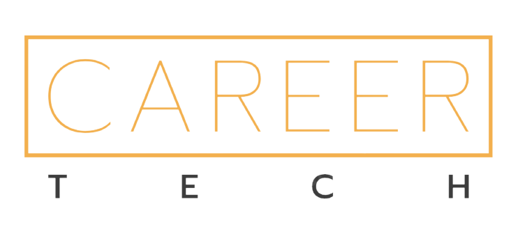

# Lil JunHyeon
교육 분야에 한 획을 긋는 소프트웨어를 통해 사회에 도움이 되고자하는 
🔥 **프론트엔드 개발자 & PM** 임준현입니다! 🔥
 
 
## 기술 블로그 Kommit!
[kommit!](https://kommit.kr/)  
 

## Problem Solving (알고리즘 문제해결)
[wnsgus821(Platinum V)](https://solved.ac/profile/wnsgus821)   
[retro5pect(Pupil)](https://solved.ac/profile/wnsgus821)   

## 연력
 &nbsp;&nbsp;2020 | 인하대학교 컴퓨터공학과 1학년 1학기 

 

&nbsp;&nbsp;2021 | 육군 전산병(시뮬레이션 지원) 복무

 

&nbsp;&nbsp;2022 | 소프트웨어 마에스트로 13기 연수중

# 임준현 (JunHyeon Lim) - Web Frontend Developer
> 도전하며 성장하는 프론트엔드 개발자 임준현입니다!

[👉 노션 포트폴리오 보러 가기](https://aim-higher.notion.site/Developement-Portfolio-62e17cb1cf77458883e68d892168716d)

## Career
<!-- 
<table>
<tr>
<td align="center" width="250">
 <a href="https://ejn.gg">

  <b>(주)이제이엔</b>
</a> 
      2022/04/21 ~ 현재 
      백엔드팀 백엔드개발자 
		</td>
		<td align="center" width="250">
			 <a href="https://imforyou.co.kr">
				
			    <b>(주)엠에이치큐</b>
			</a> 
      2021/10/01 ~ 2022/04/18 
      웹개발팀 매니저 
		</td>
		<td align="center" width="250">
			 <a href="http://jobmap.kr">
				
				  <b>(주)미래직업전망연구원</b>
			</a> 
      2019/09/01 ~ 2021/08/31 
      플랫폼개발사업본부 선임연구원 
		</td>
	</tr>
</table> -->

## Side Projects
<table>
<tr>
<td align="center" width="225">
<a href="https://github.com/kommiter/exquiz.me-fe">

 <b>실시간 퀴즈 플랫폼 exquiz.me</b>
</a> 
2022/07/21 ~ 2022/07/25 
Next.js, FastAPI, MariaDB, Redis 
<a target="_blank" href="https://exquiz.me">exquiz.me</a>
</td>
		
<td align="center" width="225">
<a href="#">				

 <b>영상 클립 플랫폼 Clippy.kr</b>
</a> 
2022/11/24 ~ 2023/02/14 
Next.js, NestJS, MariaDB, Redis 
<a target="_blank" href="https://clippy.kr">clippy.kr</a>
</td>

<td align="center" width="225">
<a href="https://github.com/kommiter/junharry">

 <b>나만의 심리 상담 앱, mamind</b>
</a> 
2022/06/26 ~ 2022/07/02 
React.js, FastAPI, MariaDB, Redis 
<a target="_blank" href="https://mamind.kr">mamind.kr</a>
</td>
</tr>

<tr>
<td align="center" width="225">
<a href="https://github.com/kommiter/leaven-minigame">

 <b>화상 기반 컨택 플랫폼, Careertech</b>
</a> 
2022/06/05 ~ 2022/06/05 
Next.js, Tailwind CSS 
<a target="_blank" href="https://careertek.kr">careertek.kr</a>
</td>
</tr>
				
</table>

 

## Tech Stacks

 
  Frontend
    
   
   
   
   
   
   
   
   
<!--    
    -->
    
  Backend
    
   
   
<!--    
    -->
   
<!--    
    -->
   
   
<!--    
    -->
    
  Infrastructure
    
   
<!--    
    -->
   
   
<!--     -->
<!--     -->

  

<!---
## Tools
retro5pect/retro5pect is a ✨ special ✨ repository because its `README.md` (this file) appears on your GitHub profile.
You can click the Preview link to take a look at your changes.
--->
