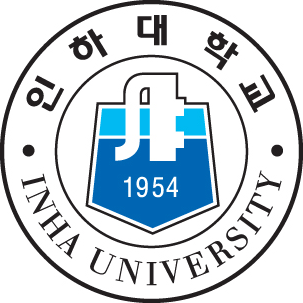

# Lim JunHyeon

### 안녕하세요! :) 가치를 창출하는 데 보람을 느끼는 풀스택 개발자 지망생 임준현입니다.

## 연력
  2020 | 인하대학교 컴퓨터공학과 1학년 1학기 
####  2021 | 육군 전산병(시뮬레이션 지원) 복무
####  2022 | 소프트웨어 마에스트로 13기 연수중

## Status

## Platforms & Languages

## Tools
<!---
AimHigher77/AimHigher77 is a ✨ special ✨ repository because its `README.md` (this file) appears on your GitHub profile.
You can click the Preview link to take a look at your changes.
--->
