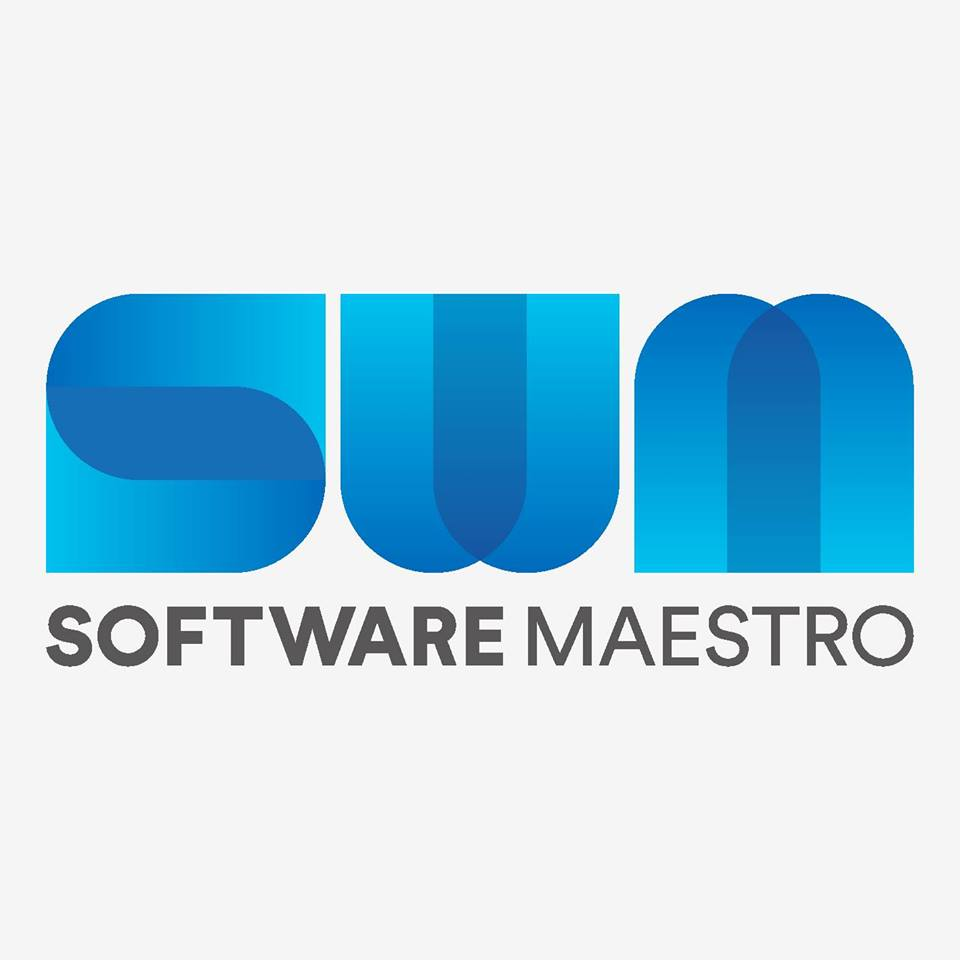

# Lil JunHyeon
## Blog
<a link="https://retro5pect.tistory.com/" target="_blank">retro5pect's retrospect </a>
## Github / Discord
retro5pect / retro5pect #1000
## BOJ / Codeforces
wnsgus821(Platinum V) / retro5pect(Gray : 1135)

## 연력
 &nbsp;&nbsp;2020 | 인하대학교 컴퓨터공학과 1학년 1학기 

 

&nbsp;&nbsp;2021 | 육군 전산병(시뮬레이션 지원) 복무

 

&nbsp;&nbsp;2022 | 소프트웨어 마에스트로 13기 연수중

## Status
 

 
    
  <h2> Frontend </h2>
    
   
   
   
   
   
<!--     -->
<!--     -->
<!--    -->
    
  <h2> Backend </h2>
    
   
    
  <h2>Infrastructure</h2>
    
   
   
<!--     -->

## Tools
<!---
retro5pect/retro5pect is a ✨ special ✨ repository because its `README.md` (this file) appears on your GitHub profile.
You can click the Preview link to take a look at your changes.
--->
